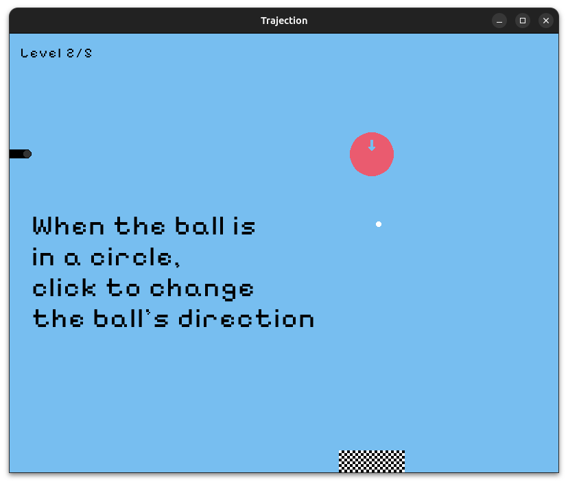

# Trajection


## Description

Manipulate gravity across 5 levels of trajectory-bending action.

## Build and run

### Requirements

- `git`

- [`raylib`](https://www.raylib.com/)

- `cmake` v3.24+

- A C99 compiler, e.g., `gcc`, or `clang`

### Steps

- Download this repository with `git clone`.

- Navigate to the cloned directory and configure with:

```bash
cmake -S . -B build
```

- Build the project with

```bash
cmake --build build
```

- Play Trajection with:

```bash
    ./build/trajection
```

- Alternatively, open Trajection's level editor with:

```bash
    ./build/Debug/trajection-editor levels.dat
```

Trajection's level editor accepts a single command-line argument that is the
path to the file containing the list of levels you would like to edit. Each
file contains exactly 5 levels. If the specified file does not exist, the level
editor will create it; otherwise the editor will enable you to edit the levels
that are already in the file.

The Trajection game itself also accepts a single optional command-line
argument, which is the name of file containing the levels you would like to
play. If you do not provide this command-line argument, then Trajection will
load five default levels for you to start playing with right away.

### Features

- 5 levels of physics-altering fun!

- A level-editor for making your own set of levels.

### Controls

Main game:

- Click the mouse to fire the ball.

- When the ball flies over a circle with an arrow, click the mouse again to
  change the direction of the ball's velocity to that of the arrow.

Editor:

- `n`: Place the cannon that will fire the ball when this level starts. A level
  can contain at most one cannon.

- `c`: Place a "turn circle" for redirecting the ball's gravity. A level can
  contain at most 16 turn circles.

- `w`: Place a wall that the ball cannot fly past. A level can contain at most
  48 walls.

- `f`: Place a finish line square. If the ball touches one of these, then the
  game will go to the next level, or the win screen if there are no more
  levels.

- `e`: The cursor will turn into a pink square. Click the mouse when the pink
  square is inside something to delete it.

- `1`: If you are placing a cannon or turn circle, change its direction to left.

- `2`: If you are placing a cannon or turn circle, change its direction to right.

- `3`: If you are placing a cannon or turn circle, change its direction to up.

- `4`: If you are placing a cannon or turn circle, change its direction to down.

- Right arrow: Edit the next level in the currently-open set of levels (each
  level files contains a series of five levels).

- Left arrow: Edit the previous level in the currently-open set of levels.

### Screenshots





### Credits

- [`raylib`](https://www.raylib.com/)

### Links

- itch.io Release: <https://brent-pappas.itch.io/trajection>

### License

This game sources are licensed under an unmodified zlib/libpng license, which
is an OSI-certified, BSD-like license that allows static linking with closed
source software. Check [LICENSE](LICENSE) for further details.

Copyright (c) 2025 Brent Pappas
